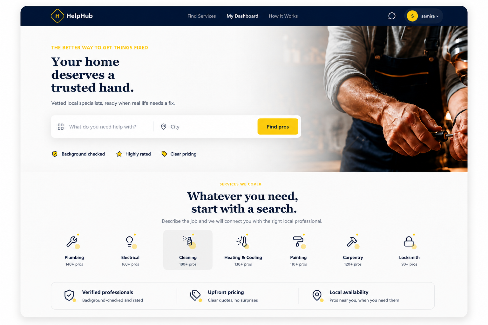
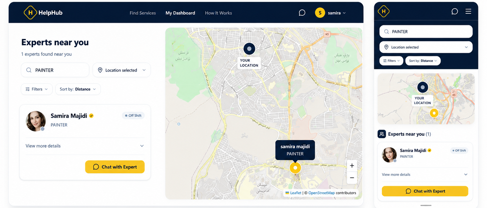
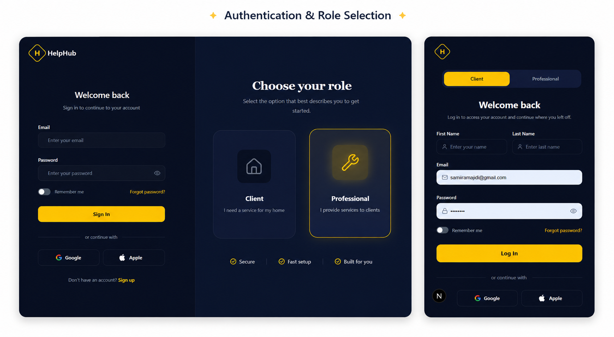
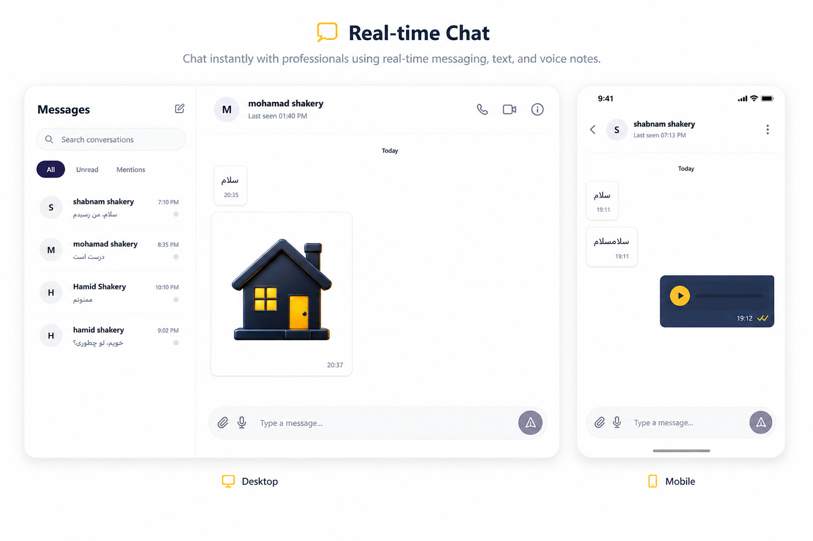
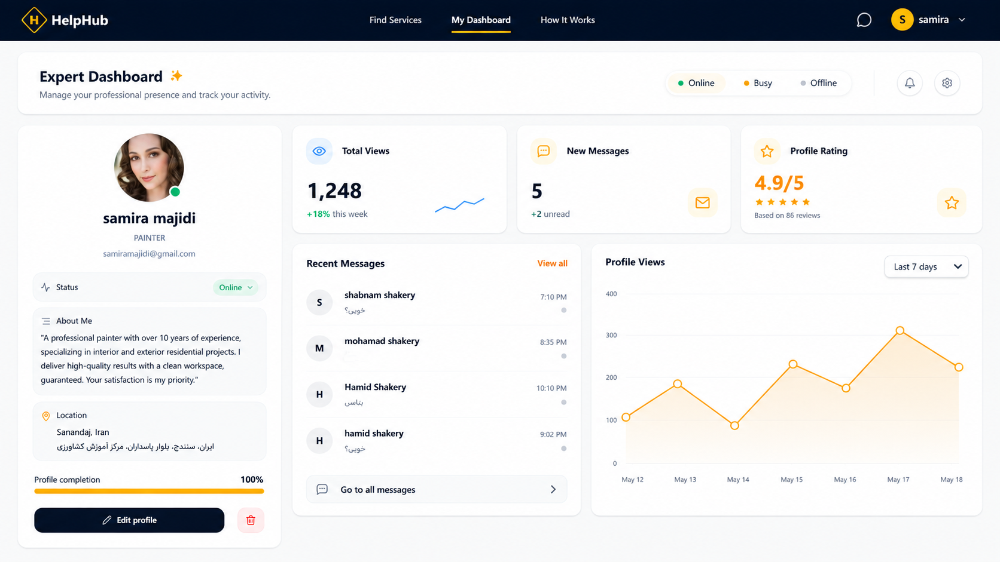

# HelpHub Frontend

A production-oriented frontend for **HelpHub**, a location-based platform that helps users discover nearby specialists, view specialist profiles, and communicate with them in real time.

The frontend is built with **Next.js App Router**, **TypeScript**, **TanStack Query**, **Zustand**, **React Hook Form**, **Socket.IO**, and **React Leaflet**.

The project focuses on a few practical frontend problems that appear in real applications: authentication state management, server/client boundaries in Next.js, real-time communication, geolocation-based discovery, media handling, responsive layouts, and synchronization between REST APIs and WebSocket events.

---

## Overview
<p align="center">
  
</p>

HelpHub has two main user flows.

Users can search for specialists based on their location, browse nearby profiles, inspect specialist information, and start a conversation.

Specialists can manage their professional profile, including their category, bio, profile image, and location, and communicate with users through the same platform.

The frontend communicates with the backend through:

* REST APIs for regular application data
* WebSocket connections for real-time chat and notifications
* Browser Geolocation APIs for the user's current position
* OpenStreetMap tiles through React Leaflet for map-based interactions

---

## Core Features

### Specialist Discovery

<p align="center">
  
</p>

Users can search for specialists using:

* Specialist category
* Latitude and longitude
* Location-based results
* Distance information
* Specialist availability/status

Search parameters are synchronized with the URL, which makes search state shareable and easier to preserve during navigation.

The result cards expose additional specialist information such as biography, rating, coordinates, distance, and account information.

---

### Authentication
<p align="center">
  
</p>
Authentication is implemented with a combination of:

* Zustand
* Zustand Persist
* Cookie-based client storage
* JWT access tokens
* Axios API requests

The frontend supports:

* User registration
* Specialist registration
* Login
* Role-aware navigation
* Persistent authentication state
* Protected UI flows

After successful authentication, the application updates the persisted auth state and redirects the user back to the application.

The frontend also reads the persisted authentication cookie inside the root server layout and uses the JWT payload to provide the initial authentication information required by the navigation layer.

> **Important:** authentication UI state and backend authorization are separate concerns. The frontend hides or gates parts of the UI, but backend authorization remains responsible for protecting API and WebSocket resources.

---

## Real-Time Chat
<p align="center">
  
</p>

Chat is one of the main technical parts of the application.

The frontend uses **Socket.IO** for real-time communication while REST APIs are used for initial message history and pagination.

The main chat flow is:

```text
User opens conversation
        ↓
Access token is read from auth state
        ↓
Socket connection is established
        ↓
User joins the direct room
        ↓
Initial messages are loaded through REST
        ↓
New messages arrive through Socket.IO
        ↓
React state is updated
        ↓
UI renders the new message immediately
```

The chat implementation handles:

* Direct conversations
* Room joining/leaving
* Sending messages
* Receiving messages
* Typing indicators
* Read state
* Online/offline status
* Last seen state
* Cursor-based message pagination
* Image messages
* Audio messages
* Message de-duplication

The frontend loads the most recent messages first and requests older messages using a cursor instead of loading the entire conversation at once.

---
## Specialist Dashboard

<p align="center">
  
</p>

Specialists can manage their professional profile and access their dashboard from the application.

...
## Message Types

The chat interface supports multiple message types:

```text
TEXT
IMAGE
AUDIO
```

Text messages are rendered directly in the conversation.

Image messages use the media URL returned by the backend.

Audio messages are handled through custom playback and recording components rather than relying entirely on the browser's default controls.

---

## Voice Messages

The frontend supports recording voice messages directly in the browser.

The recorder uses:

```ts
navigator.mediaDevices.getUserMedia({
  audio: true,
});
```

and the browser's:

```ts
MediaRecorder
```

API.

The recording flow is:

```text
Request microphone permission
        ↓
Start MediaRecorder
        ↓
Collect audio chunks
        ↓
Stop recording
        ↓
Create audio/webm Blob
        ↓
Upload media
        ↓
Send resulting attachment through chat
```

The UI also provides controls for cancelling or sending the recording and cleans up active media tracks when recording ends.

This means voice messaging is implemented as an actual browser media flow rather than being a static audio-upload form.

---

## Chat Pagination

Message history uses cursor-based pagination.

The initial request loads a limited number of messages:

```text
GET /chat/rooms/{roomId}/messages?limit=20
```

When older messages are requested, the frontend sends the cursor returned by the previous response.

This avoids loading an entire conversation into the browser and keeps the amount of initial data relatively small.

Incoming messages and paginated results are also de-duplicated before being added to the local message state.

---

## Real-Time Presence

The frontend listens for user presence changes through WebSocket events.

The UI can react to:

* Online state
* Offline state
* Last seen information
* Typing state

Presence information is therefore not treated as static profile data. It is synchronized through the real-time connection.

---

## Read State

The chat UI tracks whether messages have been read.

When a new message is received from the active conversation partner, the frontend can mark the conversation as read and react to corresponding WebSocket events.

This allows the conversation UI to distinguish between received messages and their current read state.

---

## Notifications

Notifications are also handled through Socket.IO.

The frontend only establishes the notification socket when a valid access token is available.

The notification flow is:

```text
Authenticated user
        ↓
Connect to notification namespace
        ↓
Listen for newNotification
        ↓
Update local notification state
        ↓
Display feedback to the user
```

For new-message notifications, the frontend also invalidates the recent conversations query so the conversation list can reflect the latest activity.

Supported notification categories currently handled by the UI include:

* New messages
* System alerts
* Order updates
* Default notification handling

This implementation represents **real-time in-app notifications**. It is not a native browser/mobile push notification system such as FCM or APNs.

---

## Location-Based Discovery

Location is an important part of the HelpHub frontend.

The application uses:

* Browser Geolocation API
* React Leaflet
* OpenStreetMap tiles
* URL-based search state
* Backend-provided specialist coordinates

The user can select or update a location through the map interface.

The selected coordinates are then used by the specialist search flow.

---

## Map Architecture

The map layer is separated into reusable components.

The main pieces include:

```text
MapPicker
    ↓
DynamicMapPicker
    ↓
MapField
    ↓
ExpertProfileForm / Search Form

ExpertsMapView
    ↓
ExpertsMapContainer
```

The application dynamically loads the interactive map with server-side rendering disabled because Leaflet depends on browser APIs.

This keeps browser-only map logic out of the server rendering path.

---

## Browser Geolocation

The map picker attempts to use the browser's current location when available.

The location can also be selected manually by clicking or moving the marker on the map.

The map can then move its viewport to the selected coordinates.

This gives the application two practical location input methods:

```text
Browser location
        OR
Manual map selection
```

---

## Specialist Profile Management

Specialists can manage their profile through a form built with **React Hook Form**.

The profile form includes:

* Specialist category
* Biography
* Profile image
* Geographic location

Controlled fields are integrated with React Hook Form using `Controller`.

Images are uploaded through the shared upload flow before their identifiers are submitted as part of the profile data.

---

## Reverse Geocoding

For specialist locations, the frontend can use Nominatim reverse geocoding to turn latitude/longitude values into a human-readable address.

The application therefore keeps the backend location data in coordinate form while presenting a more understandable representation to the user.

This is especially useful on specialist profile and dashboard views.

---

## Data Fetching

The frontend uses **TanStack Query** for server-state management.

It is used for operations such as:

* Specialist search
* Specialist profile retrieval
* Category retrieval
* Conversations
* Recent conversation data
* Server-backed application data

The application does not attempt to put all server data into Zustand.

This separation keeps authentication/client state and server state as different concerns.

---

## Category Data Caching

Category data changes relatively infrequently, so the frontend uses a lightweight caching strategy.

TanStack Query is configured with a long stale time for categories:

```ts
staleTime: 24 * 60 * 60 * 1000
```

The category API layer also maintains a cached Promise so repeated requests during the same client lifecycle can reuse the existing request.

The result is effectively:

```text
First request
    ↓
Fetch categories
    ↓
Cache response/query
    ↓
Subsequent consumers reuse cached data
```

This avoids unnecessary repeated requests for relatively static lookup data.

---

## Forms and Validation

Forms are primarily implemented with:

* React Hook Form
* Controlled inputs
* Client-side validation
* API error handling

Authentication forms include local validation for values such as email and password.

Profile forms use controlled fields for more complex inputs such as category selectors, file uploads, and map location.

The frontend also relies on backend validation, so client-side validation is treated as a user-experience layer rather than the application's security boundary.

---

## UI Authentication Gates

Some actions are intentionally available only to authenticated users.

For example, when an unauthenticated user attempts to start a conversation with a specialist, the frontend displays an authentication-required modal instead of immediately opening the chat flow.

The flow is:

```text
Click "Chat with Expert"
        ↓
Check authentication state
        ↓
Authenticated?
   ┌────┴────┐
   │         │
  Yes        No
   │         │
Open chat   Show auth modal
```

This is a UI-level access decision.

It should not be confused with backend authorization, which is responsible for protecting the actual resources.

---

## Navigation Architecture

The navigation layer adapts to the current application state.

Examples include:

* Public navigation
* Authenticated navigation
* Specialist dashboard navigation
* Mobile navigation
* Chat-specific layouts

The main navbar is not rendered on certain routes such as authentication pages and chat routes where a dedicated experience is used.

The specialist dashboard also has its own dashboard navigation layer.

---

## Responsive Chat UI

The chat interface changes structure depending on viewport size.

On larger screens:

```text
┌─────────────────────┬────────────────────────────┐
│ Conversation List   │ Active Conversation        │
│                     │                            │
│ User A              │ Messages                  │
│ User B              │ Messages                  │
│ User C              │ Composer                  │
└─────────────────────┴────────────────────────────┘
```

On smaller screens, the application switches between the conversation list and active conversation instead of maintaining both panels side by side.

This keeps the same chat functionality usable on mobile layouts.

---

## Next.js Architecture

HelpHub uses the **Next.js App Router**.

The application takes advantage of the distinction between:

```text
Server Components
        +
Client Components
        +
Browser-only dynamic imports
```

The root layout is implemented as an asynchronous Server Component and reads the authentication cookie server-side before passing the initial navigation information into the client-side navigation layer.

Interactive features such as:

* Chat
* Maps
* Browser geolocation
* Authentication forms
* Zustand state
* Audio recording

remain client-side where browser APIs or interactive state are required.

---

## Client-Only Components

Some application features depend on browser APIs and therefore cannot be rendered normally on the server.

A notable example is Leaflet.

The map picker is dynamically imported with server-side rendering disabled:

```ts
dynamic(() => import(...), {
  ssr: false,
})
```

A similar approach is used for selected dashboard/chat components where browser-side behavior is required.

---

## Routing

The application uses Next.js file-system routing.

Important routes include:

```text
/
├── /sign-up
├── /chats
├── /chat/[id]
├── /result-page
├── /expert-profile/[id]
├── /dashboard-expert
└── ...
```

Dynamic routes are used where the displayed data depends on an identifier, such as:

```text
/chat/[id]
```

and:

```text
/expert-profile/[id]
```

---

## State Management

The frontend uses two different state-management approaches for different problems.

### Zustand

Zustand is primarily used for client-side authentication state.

The persisted authentication state includes information such as:

* Access token
* Authentication status
* User-related auth information

Persistence is implemented through a custom `js-cookie` storage adapter.

### TanStack Query

TanStack Query handles server state such as:

* Specialists
* Categories
* Conversations
* Profiles
* Other API-backed resources

This separation avoids turning Zustand into a global store for every piece of server data.

---

## Authentication Storage

The authentication store uses a cookie-backed persistence layer.

The cookie configuration includes:

```text
Secure     → enabled in production
SameSite   → Strict
Expiration → 1 day
```

The access token is still stored in a client-accessible cookie rather than an HttpOnly cookie.

This is an important architectural/security detail and should not be described as an HttpOnly-token architecture.

---

## API Integration

The frontend uses Axios for REST communication.

The base URL is controlled through:

```env
NEXT_PUBLIC_API_URL
```

The application also provides a local development fallback:

```text
http://localhost:8080
```

Production Docker builds use:

```text
https://helphub-app.me/api
```

The frontend communicates with the backend through a combination of HTTP API requests and Socket.IO connections.

---

## WebSocket Integration

Socket connections are initialized through the application's socket service rather than creating raw Socket.IO connections separately inside every component.

The access token is provided to authenticated socket connections.

Different namespaces are used for different real-time responsibilities:

```text
/chat
/notification
/experts
```

The chat hook manages the lifecycle of its own connection:

```text
Read token
    ↓
Connect socket
    ↓
Join room
    ↓
Register event listeners
    ↓
Handle messages/presence/read state
    ↓
Cleanup listeners
```

---

## Uploads and Media

The frontend integrates with the backend upload system rather than directly implementing object storage logic.

The application uses shared upload components and services for:

* Profile images
* Chat images
* Audio messages

Audio recording produces browser-side media that is passed through the upload flow before being sent as a chat attachment.

The actual object storage implementation remains a backend responsibility.

---

## Specialist Dashboard

The specialist dashboard provides sections for:

* Profile information
* Profile management
* Status management
* Conversations

The dashboard is structured around reusable components rather than a single monolithic page.

Examples include:

```text
ExpertStatusManager
ExpertProfile
DashboardSimpleConversationList
```

The dashboard also contains profile-related information such as status, biography, category, location, and profile presentation.

---

## Current Dashboard Analytics

The current dashboard includes presentation UI for profile statistics and charts.

Some of the displayed dashboard numbers and chart data are currently hardcoded in the frontend.

They should therefore be treated as UI/demo data rather than a production analytics pipeline.

The frontend does not currently demonstrate a backend-powered analytics system for those values.

This distinction matters because calling a static `1,248 views` value "real analytics" would be a slightly embarrassing README crime.

---

## Project Structure

A simplified structure looks like:

```text
src/
├── app/
│   ├── chat/
│   ├── chats/
│   ├── dashboard-expert/
│   ├── expert-profile/
│   ├── result-page/
│   └── sign-up/
│
├── components/
│   ├── auth/
│   ├── chat/
│   ├── dashboard/
│   ├── expert/
│   ├── map/
│   ├── navbar/
│   └── ...
│
├── hooks/
│   ├── auth/
│   ├── chat/
│   ├── expert/
│   └── ...
│
├── services/
│   ├── api/
│   ├── socket/
│   └── upload/
│
├── store/
│   └── auth/
│
└── ...
```

The exact implementation can evolve as the project grows, but the main architectural separation is between routes, reusable UI, hooks, API/socket services, and client-side state.

---

## Docker

The frontend is containerized using a multi-stage Docker build.

The Dockerfile uses:

```text
Node.js 22 Alpine
```

and separates:

```text
Dependencies
    ↓
Build
    ↓
Runtime
```

The runtime image uses the standalone Next.js output and runs the application under a dedicated non-root user.

The application exposes:

```text
3000
```

The Docker Compose configuration maps:

```text
3000:3000
```

The production build arguments currently point the frontend to:

```text
NEXT_PUBLIC_API_URL=https://helphub-app.me/api
NEXT_PUBLIC_SOCKET_URL=https://helphub-app.me
NEXT_PUBLIC_APP_NAME=helphub
```

The Docker setup also uses:

```text
.env.local
```

for runtime environment configuration.

---

## Environment Variables

The frontend expects variables such as:

```env
NEXT_PUBLIC_API_URL=http://localhost:8080
NEXT_PUBLIC_SOCKET_URL=http://localhost:8080
NEXT_PUBLIC_APP_NAME=helphub
```

Production deployments use the deployed backend/socket URLs instead.

Because these values use the `NEXT_PUBLIC_` prefix, they are intended to be available to the client bundle.

Sensitive backend credentials must therefore never be placed in frontend environment variables.

---

## Local Development

### 1. Install dependencies

```bash
npm install
```

### 2. Configure environment variables

Create the appropriate local environment file and define:

```env
NEXT_PUBLIC_API_URL=http://localhost:8080
NEXT_PUBLIC_SOCKET_URL=http://localhost:8080
NEXT_PUBLIC_APP_NAME=helphub
```

### 3. Start the development server

```bash
npm run dev
```

The application will normally be available at:

```text
http://localhost:3000
```

Make sure the HelpHub backend is running on the configured API URL.

---

## Production Build

Create a production build with:

```bash
npm run build
```

Then start the production application with:

```bash
npm run start
```

For the Docker-based deployment, the image is built using the repository's Dockerfile and the required public environment variables are injected as build arguments.

---

## Performance Considerations

Several frontend decisions are intentionally designed to avoid unnecessary work.

### Server/client separation

Server-side layout logic is kept separate from browser-only interactive features.

### TanStack Query caching

Server data is cached through TanStack Query instead of repeatedly requesting the same resources.

### Category caching

Category data uses a long stale time and a cached Promise.

### Cursor pagination

Chat history does not load the entire conversation at once.

### Dynamic map loading

Leaflet is loaded client-side instead of being forced through server rendering.

### Standalone Next.js output

The Docker runtime uses Next.js standalone output to produce a smaller deployment-oriented runtime structure.

---

## Error and Loading States

The UI includes reusable states for common request conditions, including:

* Loading
* Error
* Empty results
* Invalid route parameters
* Authentication-required actions

For example, the dynamic chat route validates the route identifier before attempting to load the conversation.

This keeps invalid navigation from immediately turning into an uncontrolled client-side failure.

---

## Security Considerations

The frontend includes several security-conscious implementation details, but it does not attempt to solve server-side security itself.

Current frontend considerations include:

* JWT-based authenticated API/socket communication
* `SameSite=Strict` cookie configuration
* `Secure` cookies in production
* Auth-gated UI actions
* Client-side form validation
* Token-aware WebSocket connections
* Avoiding authenticated socket connections when no access token exists

However, several boundaries remain intentionally backend responsibilities:

```text
Authorization
Resource ownership
JWT verification
Rate limiting
Database security
Upload authorization
Socket authorization
```

The frontend should therefore never be treated as the final authorization layer.

---

## Testing

The project structure supports component and application-level testing, but the supplied frontend implementation does not demonstrate a comprehensive automated frontend test suite.

The README therefore does not claim broad test coverage that is not present in the current codebase.

The backend contains its own testing setup and should be treated separately from frontend test coverage.

---

## Known Limitations

The current frontend contains several areas that are visibly prepared in the UI but are not demonstrated as complete backend integrations.

### Authentication UI

The login page contains UI for:

* Remember me
* Forgot password
* Google authentication
* Apple authentication

The supplied implementation does not demonstrate complete working integrations for these flows.

### Filters and sorting

The specialist results page exposes filter and sorting UI, but the supplied implementation does not demonstrate full server-side behavior for every visible filter/sort control.

### Dashboard analytics

Some dashboard statistics and graph values are static UI data rather than live analytics.

### Authentication storage

The access token is stored in a client-accessible cookie and is not stored in an HttpOnly cookie.

This is a meaningful security consideration for a production application.

---

## Engineering Decisions

A few decisions in the project are worth calling out because they reflect practical application architecture rather than framework usage alone.

### REST + WebSocket instead of WebSocket-only chat

REST is used for durable message-history retrieval and pagination.

WebSockets are used where real-time delivery matters.

This keeps historical data fetching and real-time event delivery separate.

### TanStack Query + Zustand

The application avoids using one state-management tool for everything.

Zustand handles client-side authentication state while TanStack Query manages server state.

### Browser-only map loading

Leaflet is isolated from server rendering because the map depends on browser APIs.

### URL-synchronized search

Specialist search parameters are reflected in the URL, making location/category state easier to preserve across navigation.

### Explicit auth gating

The UI does not blindly assume that every visitor is authenticated. Public specialist discovery remains possible while actions such as starting a chat can require authentication.

---

## Frontend / Backend Integration

The frontend is designed around the HelpHub backend rather than functioning as an isolated mock application.

The main integration points are:

```text
Next.js
   │
   ├── Axios ──────────────── REST API
   │                              │
   │                              ├── Authentication
   │                              ├── Specialists
   │                              ├── Profiles
   │                              ├── Messages
   │                              └── Uploads
   │
   └── Socket.IO ─────────── WebSocket
                                  │
                                  ├── Chat
                                  ├── Presence
                                  ├── Read state
                                  └── Notifications
```

This split allows the frontend to use conventional request/response flows for persistent data while maintaining real-time behavior where it actually matters.

---

## What This Project Demonstrates

From an engineering perspective, the frontend demonstrates experience with:

* Next.js App Router
* TypeScript
* Server and Client Components
* Zustand
* TanStack Query
* React Hook Form
* Axios
* Socket.IO
* Real-time chat state
* WebSocket presence
* Cursor-based pagination
* Browser MediaRecorder APIs
* Browser Geolocation APIs
* React Leaflet
* URL-based search state
* Responsive application layouts
* Dynamic imports for browser-only dependencies
* Dockerized Next.js deployment
* Client/server security boundaries

The main value of the project is not the number of pages. It is the way several independent concerns are combined into one application:

```text
Authentication
+
Location
+
Server state
+
Real-time communication
+
Media
+
Responsive UI
+
Deployment
```

---

## Related Backend

The frontend is part of the larger HelpHub system and works with the separate NestJS backend.

Backend repository:

```text
https://github.com/samira-majidi/helphub-backend
```

Frontend repository:

```text
https://github.com/samira-majidi/helphub-frontend
```

Application:

```text
https://helphub-app.me/
```

---

## Project Status

HelpHub is a completed portfolio project with a deployed frontend/backend architecture and real-time functionality.

The current codebase intentionally contains a few UI areas that are prepared for future integrations, particularly social authentication, password recovery, richer search filters, and live dashboard analytics.

Those areas are documented as limitations rather than being presented as completed features.

---

## Author

**Samira Majidi**

Full-Stack Web Developer focused on TypeScript, NestJS, Next.js, backend systems, real-time applications, and practical web architecture.

GitHub:

```text
https://github.com/samira-majidi
```